# Financial Risk Monitor

A systemic financial risk dashboard that tracks four interconnected risk domains and computes cross-domain correlations as an early warning system — then lets you interpret the results through two competing analytical lenses.

The same 18 tickers. The same correlation math. The same time series data. Two fundamentally different conclusions about what it all means.

## The Two Frameworks

**Bookstaber (Systemic Risk)** — Based on Richard Bookstaber's March 2026 NYT thesis that private credit, AI/tech concentration, energy/geopolitical shocks, and cross-domain contagion are tightly coupled. A shock to any one can cascade through the others. The key signal: when rolling correlations between normally-independent domains spike toward 1.0, forced selling is propagating across markets. Physical risks (energy, chips, supply chains) don't have the escape valves that financial risks had in 2008.

**Yardeni (Resilience)** — Based on Ed Yardeni's "Roaring 2020s" thesis that the US economy is structurally resilient despite geopolitical shocks. Baby boomer wealth ($85T net worth) provides a consumer spending floor. US energy independence blunts oil shock transmission. Distressed asset funds and bank substitution provide credit market self-healing. Geopolitical crises historically create buying opportunities, not systemic collapse. The same correlation spike that alarms Bookstaber is, to Yardeni, the setup — not the punchline.

The dashboard doesn't tell you which one is right. It shows you what each framework makes of the same data, and lets you decide which regime we're actually in.

## Architecture



Three independent services communicate via a shared TimescaleDB instance:

- **Ingestion** (`services/ingestion/`) — Go service with tiered polling: Finnhub (5-min REST + WebSocket for 18 tickers), FRED (daily credit spreads + Treasury yields), Valyu (hourly news sentiment + daily SEC filings/insider trading). Writes raw market data to `time_series`.
- **Correlation** (`services/correlation/`) — Python service computing domain indices, rolling 30-day Pearson correlations across 3 pairwise combinations, threat scores (0–100 per domain) under both frameworks simultaneously, and alert evaluation. Runs on a 5-minute cycle. Bookstaber scores use standard tickers (`SCORE_COMPOSITE`), Yardeni scores use prefixed tickers (`YARDENI_SCORE_COMPOSITE`).
- **Dashboard** (`src/`) — Next.js 15 app with API routes that read from TimescaleDB. Dark-themed Recharts dashboard with React Query for live data fetching. Framework toggle in the header switches between Bookstaber and Yardeni interpretations instantly — no reload, no re-computation.

All ingestion and correlation scoring weights, thresholds, and alert rules are defined in YAML config files; UI and API framework presets are configured in TypeScript.

## Quick Start

### Prerequisites

- Docker with 8GB+ memory allocated
- Node.js 18+ and [pnpm](https://pnpm.io/)
- API keys: [Finnhub](https://finnhub.io/register) (free tier), [FRED](https://fred.stlouisfed.org/docs/api/api_key.html), [Valyu](https://valyu.ai)

### Environment Setup

```bash
export FINNHUB_API_KEY="<your-finnhub-key>"
export FRED_API_KEY="<your-fred-key>"
export VALYU_API_KEY="<your-valyu-key>"
export TIMESCALEDB_PASSWORD="riskmonitor"
```

### Option A: Full Docker Stack

```bash
docker compose up -d
docker compose ps   # Expect 4 services: timescaledb, ingestion, correlation, app
```

> If the `app` container OOMs during build, use Option B instead. The Next.js production build is memory-intensive.

### Option B: Backend in Docker + Local Dev Server (recommended)

```bash
# Start backend services
docker compose up -d timescaledb ingestion correlation

# In a separate terminal
pnpm install
pnpm dev   # http://localhost:3000
```

## Risk Domains

| Domain                  | Bookstaber Weight | Yardeni Weight | Key Tickers                                       | What It Tracks                                   |
| ----------------------- | ----------------- | -------------- | ------------------------------------------------- | ------------------------------------------------ |
| Private Credit Stress   | 0.30              | 0.25           | OWL, ARCC, BXSL, OBDC, HYG, HY spread (FRED)      | BDC NAV discounts, HY spreads, redemption flows  |
| AI / Tech Concentration | 0.20              | 0.20           | NVDA, MSFT, GOOGL, META, AMZN, SMH, SPY/RSP ratio | Market cap concentration, semiconductor exposure |
| Energy / Geopolitical   | 0.25              | 0.30           | CL=F, NG=F, XLU, EWT                              | Crude oil level/volatility, Taiwan ETF drawdown  |
| Cross-Domain Contagion  | 0.25              | 0.25           | VIX (via VIXY proxy), pairwise correlations       | Max rolling correlation, volatility co-movement  |

The weight differences reflect genuine analytical disagreement. Bookstaber overweights private credit because he sees it as the accelerant — the illiquid loans that force selling into public markets. Yardeni overweights energy/geo because he takes geopolitics seriously but trusts market self-correction mechanisms to contain credit stress.

### Threat Levels

| Level    | Bookstaber Band | Yardeni Band | Color  |
| -------- | --------------- | ------------ | ------ |
| LOW      | 0 - 25          | 0 – 30       | Green  |
| ELEVATED | 26 – 50         | 31 – 55      | Yellow |
| HIGH     | 51 – 75         | 56 – 80      | Orange |
| CRITICAL | 76 – 100        | 81 – 100     | Red    |

What Bookstaber calls CRITICAL at 76, Yardeni calls HIGH. Yardeni only hits CRITICAL when multiple domains are simultaneously maxed — because he's watched 45 years of cycles and has a higher threshold for alarm.

For detailed explanations of each domain, how to interpret scores, and what to watch for, see [Interpreting the Dashboard](docs/interpreting-the-dashboard.md). For the project's origin story, data source architecture, and design constraints, see [Design Rationale](docs/design-rationale.md).

## API Endpoints

All routes are under `/api/risk/`. Routes that return scores or threat levels accept an optional `?framework=` parameter (`bookstaber` or `yardeni`, default `bookstaber`). Routes that return raw data are framework-agnostic.

| Endpoint                               | Method   | Framework-Aware | Description                                        |
| -------------------------------------- | -------- | --------------- | -------------------------------------------------- |
| `/api/risk/scores`                     | GET      | Yes             | Composite + 4 domain scores with threat levels     |
| `/api/risk/correlations?days=N`        | GET      | Yes             | Rolling pairwise correlations (threshold differs)  |
| `/api/risk/health`                     | GET      | No              | Source staleness and failure tracking              |
| `/api/risk/timeseries?ticker=X&days=N` | GET      | No              | Historical values for charting                     |
| `/api/risk/latest-prices`              | GET      | No              | Most recent price per display ticker               |
| `/api/risk/news?domain=X&limit=N`      | GET      | Yes             | Sentiment headlines by domain (sort order differs) |
| `/api/risk/freshness`                  | GET      | No              | Per-ticker data age and status                     |
| `/api/risk/alerts`                     | GET/POST | No              | Alert history and acknowledgement                  |

## Testing

### TypeScript (381+ Vitest tests)

```bash
pnpm install
pnpm test
```

### Go (Ingestion Service)

```bash
cd services/ingestion
go vet ./...
go test -count=1 ./...                    # Unit tests
go test -tags=integration -count=1 ./...  # Integration tests (requires Docker)
```

### Python (Correlation Service)

```bash
cd services/correlation
python3 -m venv .venv && source .venv/bin/activate
pip install -r requirements.txt
python -m pytest -v -k "not integration"  # Unit tests
python -m pytest -v                                                # Full suite (requires DATABASE_URL)
```

### E2E Tests

```bash
./tests/e2e-dashboard.sh      # Data pipeline E2E
./tests/e2e-correlation.sh    # Correlation engine E2E
./tests/e2e-alerting.sh       # Alerting E2E
```

All E2E scripts start Docker, seed data, run assertions, and clean up.

## Configuration

| File                                               | Purpose                                                                                 |
| -------------------------------------------------- | --------------------------------------------------------------------------------------- |
| `services/ingestion/config.yaml`                   | Tickers, polling intervals, API keys (env vars), staleness thresholds                   |
| `services/correlation/scoring_config.yaml`         | Bookstaber framework: domain weights, sub-component thresholds, threat level boundaries |
| `services/correlation/scoring_config_yardeni.yaml` | Yardeni framework: adjusted weights and wider thresholds reflecting resilience thesis   |
| `services/correlation/alert_config.yaml`           | Alert rules, consecutive reading requirements, cooldowns, channel config                |

### Adding a New Framework

The architecture is designed so that adding a third analytical lens is trivial:

1. Create `scoring_config_<name>.yaml` with your weights and thresholds
2. Add the framework to the scoring loop in `run.py` with a ticker prefix
3. Add the framework option to the API route's `?framework=` parameter
4. Add the toggle option and tooltip variants to the frontend

The data pipeline, correlation engine, and ticker coverage don't change.

## Data Sources

| Source              | What It Provides                             | Frequency               | Cost       |
| ------------------- | -------------------------------------------- | ----------------------- | ---------- |
| Finnhub (free tier) | Equity/ETF prices, WebSocket streaming       | Every 5 min + real-time | $0         |
| FRED (free w/ key)  | Credit spreads, Treasury yields              | Daily                   | $0         |
| Valyu API           | SEC filings, news sentiment, insider trading | Hourly/daily            | ~$10–20/mo |

## License

MIT — see [LICENSE](LICENSE).
