# Bookstaber Risk Monitor

A systemic financial risk dashboard that tracks four interconnected risk domains and computes cross-domain correlations as an early warning system for cascading financial crises. Built on Richard Bookstaber's thesis that private credit, AI/tech concentration, energy/geopolitical shocks, and cross-domain contagion are interconnected -- a shock to any one can cascade through the others. The key signal is when rolling correlations between normally-independent domains spike, indicating forced selling is propagating across markets.

## Architecture



Three independent services communicate via a shared TimescaleDB instance:

- **Ingestion** (`services/ingestion/`) -- Go service with tiered polling: Finnhub (5-min REST + WebSocket for 18 tickers), FRED (daily credit spreads + Treasury yields), Valyu (hourly news sentiment + daily SEC filings/insider trading). Writes raw market data to `time_series`.
- **Correlation** (`services/correlation/`) -- Python service computing domain indices, rolling 30-day Pearson correlations across 3 pairwise combinations, threat scores (0-100 per domain), and alert evaluation. Runs on a 5-minute cycle.
- **Dashboard** (`src/`) -- Next.js 15 app with API routes that read from TimescaleDB. Dark-themed Recharts dashboard with React Query for live data fetching.

All scoring weights, thresholds, and alert rules live in YAML config files -- nothing is hardcoded.

## Quick Start

### Prerequisites

- Docker with 8GB+ memory allocated
- Node.js 18+ and [pnpm](https://pnpm.io/)
- API keys: [Finnhub](https://finnhub.io/register) (free tier), [FRED](https://fred.stlouisfed.org/docs/api/api_key.html), [Valyu](https://valyu.ai)

### Environment Setup

```bash
export FINNHUB_API_KEY="<your-finnhub-key>"
export FRED_API_KEY="<your-fred-key>"
export VALYU_API_KEY="<your-valyu-key>"
export TIMESCALEDB_PASSWORD="riskmonitor"
```

### Option A: Full Docker Stack

```bash
docker compose up -d
docker compose ps   # Expect 4 services: timescaledb, ingestion, correlation, app
```

> If the `app` container OOMs during build, use Option B instead. The Next.js production build is memory-intensive.

### Option B: Backend in Docker + Local Dev Server (recommended)

```bash
# Start backend services
docker compose up -d timescaledb ingestion correlation

# In a separate terminal
pnpm install
pnpm dev   # http://localhost:3000
```

## Risk Domains

| Domain                  | Weight | Key Tickers                                       | What It Tracks                                   |
| ----------------------- | ------ | ------------------------------------------------- | ------------------------------------------------ |
| Private Credit Stress   | 0.30   | OWL, ARCC, BXSL, OBDC, HYG, HY spread (FRED)      | BDC NAV discounts, HY spreads, redemption flows  |
| AI / Tech Concentration | 0.20   | NVDA, MSFT, GOOGL, META, AMZN, SMH, SPY/RSP ratio | Market cap concentration, semiconductor exposure |
| Energy / Geopolitical   | 0.25   | CL=F, NG=F, XLU, EWT                              | Crude oil level/volatility, Taiwan ETF drawdown  |
| Cross-Domain Contagion  | 0.25   | VIX (via VIXY proxy), pairwise correlations       | Max rolling correlation, volatility co-movement  |

Composite score = weighted average of the four domain scores. Threat levels: LOW (0-25), ELEVATED (26-50), HIGH (51-75), CRITICAL (76-100).

## API Endpoints

All routes are under `/api/risk/`.

| Endpoint                               | Method   | Description                                    |
| -------------------------------------- | -------- | ---------------------------------------------- |
| `/api/risk/scores`                     | GET      | Composite + 4 domain scores with threat levels |
| `/api/risk/correlations?days=N`        | GET      | Rolling pairwise correlations (3 pairs)        |
| `/api/risk/health`                     | GET      | Source staleness and failure tracking          |
| `/api/risk/timeseries?ticker=X&days=N` | GET      | Historical values for charting                 |
| `/api/risk/latest-prices`              | GET      | Most recent price per display ticker           |
| `/api/risk/news?domain=X&limit=N`      | GET      | Sentiment headlines by domain                  |
| `/api/risk/freshness`                  | GET      | Per-ticker data age and status                 |
| `/api/risk/alerts`                     | GET/POST | Alert history (GET) and acknowledgement (POST) |

## Testing

### TypeScript (381+ Vitest tests)

```bash
pnpm install
pnpm test
```

### Go (Ingestion Service)

```bash
cd services/ingestion
go vet ./...
go test -count=1 ./...                    # Unit tests
go test -tags=integration -count=1 ./...  # Integration tests (requires Docker)
```

### Python (Correlation Service)

```bash
cd services/correlation
python3 -m venv .venv && source .venv/bin/activate
pip install -r requirements.txt
python -m pytest -v -k "not integration and not dispatch_wiring"  # Unit tests
python -m pytest -v                                                # Full suite (requires DATABASE_URL)
```

### E2E Tests

```bash
./tests/e2e-dashboard.sh      # Data pipeline E2E
./tests/e2e-correlation.sh    # Correlation engine E2E
./tests/e2e-alerting.sh       # Alerting E2E
```

All E2E scripts start Docker, seed data, run assertions, and clean up.

## Configuration

| File                                       | Purpose                                                                  |
| ------------------------------------------ | ------------------------------------------------------------------------ |
| `services/ingestion/config.yaml`           | Tickers, polling intervals, API keys (env vars), staleness thresholds    |
| `services/correlation/scoring_config.yaml` | Domain weights, sub-component thresholds, threat level boundaries        |
| `services/correlation/alert_config.yaml`   | Alert rules, consecutive reading requirements, cooldowns, channel config |

## Data Sources

| Source              | What It Provides                             | Frequency               | Cost       |
| ------------------- | -------------------------------------------- | ----------------------- | ---------- |
| Finnhub (free tier) | Equity/ETF prices, WebSocket streaming       | Every 5 min + real-time | $0         |
| FRED (free w/ key)  | Credit spreads, Treasury yields              | Daily                   | $0         |
| Valyu API           | SEC filings, news sentiment, insider trading | Hourly/daily            | ~$10-20/mo |

## License

MIT -- see [LICENSE](LICENSE).
